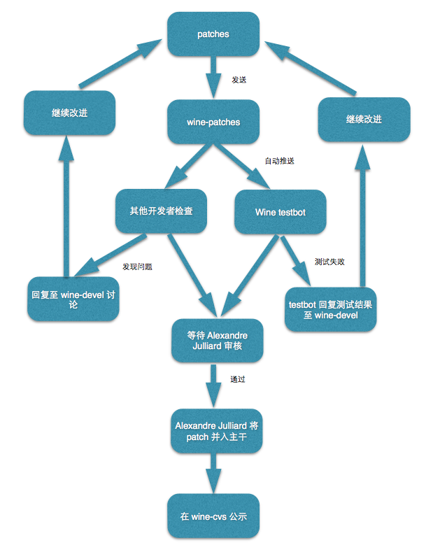
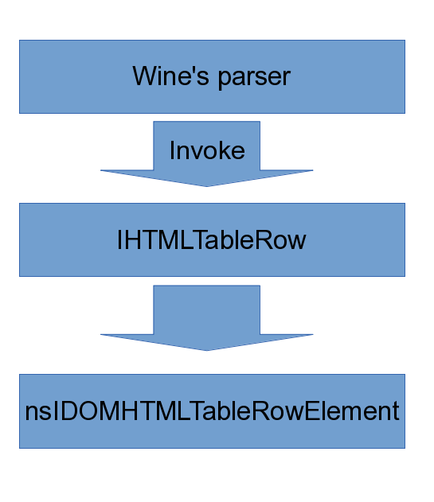

!SLIDE
#WINE & GSoC

- Zhenbo Li (Endle)
- litimetal@gmail.com
- http://endle.gitcafe.com

 

!SLIDE code
#Wine Is Not Emulator
@@@ c++
    #include <windows.h>

    int main()
    {
        DeleteFileA("C:\\sample.txt");
        return 0;
    }
@@@

!SLIDE code
#Wine Is Not Emulator
###i686-pc-mingw32-gcc sample.c -S
@@@ nasm
LC0:
.ascii "C:\\sample.txt\0"
........
_main:
........
movl	$LC0, (%esp)
call	_DeleteFileA@4
........
leave
leal	-4(%ecx), %esp
ret
.def	_DeleteFileA@4;	.scl	2;	.type	32;	.endef
@@@
#### Full version: <https://gist.github.com/Endle/cd5f4ee2d5301b697fa0>

!SLIDE
#考虑因素
- C:\\sample.txt => ~/.wine/drive_c/sample.txt
- 大小写？
- 错误处理？
- 编码方式？
- Etc.

!SLIDE
#难点
- TOO MANY JOBS! (2000, XP, Vista, Win 7, Win 8 ...)
- Undocumented Behavior
- Buggy Software (Windows)
- &nbsp;&nbsp; *QQ 2013 : bug 34324*
- Buggy Software (Linux)
- &nbsp;&nbsp;**Drivers!**
- &nbsp;&nbsp;*Gcc, Gecko, mingw, etc.*

!SLIDE
#提交补丁的流程

From [Jactry](http://jactry.com/post/2014/04/04/093335/)

!SLIDE
#注意事项
- 不要偷看代码
- 不要反汇编
- 不要跟踪 API
- **不要去微软工作**

!SLIDE
# MsHtml
#### Sample javascript code
@@@ js
var txt = "";
for (var i=0; i<x.length; i++)
  {
  txt = x[i].rowIndex+" ";
  }
document.getElementById("demo").
innerHTML=txt;
@@@

!SLIDE
#Solution of Wine

!SLIDE code
#Solution
@@@ c++
static HRESULT WINAPI HTMLTableRow_get_rowIndex(IHTMLTableRow *iface, LONG *p)
{
    HTMLTableRow *This = impl_from_IHTMLTableRow(iface);
    nsresult nsres;

    TRACE("(%p)->(%p)\n", This, p);
    nsres = nsIDOMHTMLTableRowElement_GetRowIndex(This->nsrow, p);
    if(NS_FAILED(nsres)) {
        ERR("Get rowIndex failed: %08x\n", nsres);
        return E_FAIL;
    }
    return S_OK;
}
@@@

!SLIDE
#难点
- 工作量
- &nbsp;&nbsp;*git grep E_NOTIMPL | wc -l  =>  1762*
- IE 扩展
- 错误处理
- 与其他 wine 模块的交互
- &nbsp;&nbsp;*e.g. urlmon*

!SLIDE
#Start Now!
- <http://bugs.winehq.org/>
- <http://wiki.winehq.org/>
- <http://www.freelists.org/list/wine-zh>
- <http://tinyurl.com/winedev>
- IRC: #wine-zh   at   Freenode

!SLIDE
#GSoC
- 提出构想 (proposal)
- 执行计划
- 收获祭

!SLIDE
#常见误解
- 英文不好
- 没有经验
- 懂的太少
- &nbsp;&nbsp;*项目用什么语言?*
- &nbsp;&nbsp;*哪些相关知识?*
- &nbsp;&nbsp;*Git/SVN/etc.?*

!SLIDE
#NOW OR NEVER!
- 选择合适项目
- 从最简单处入手
- &nbsp;&nbsp;*编辑文档*
- &nbsp;&nbsp;*报告 bug*
- &nbsp;&nbsp;*提交小 patch*
- 与项目其他成员讨论

!SLIDE
#Proposal 里的常见错误
- 群发 Proposal
- &nbsp;&nbsp; *自动重定向至 /dev/null*
- 强调 “I will work hard”
- &nbsp;&nbsp; *空谈误国，实干兴邦*
- 侧重点不当
- &nbsp;&nbsp;*GPA 4.0 不如 openhub.net / github.com 的记录*
- 目标太大
- &nbsp;&nbsp;*“我要重构整个项目！”*

!SLIDE
#ENJOY!
###谢谢
